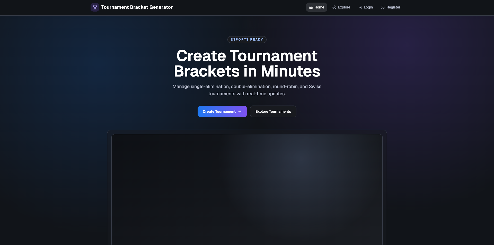
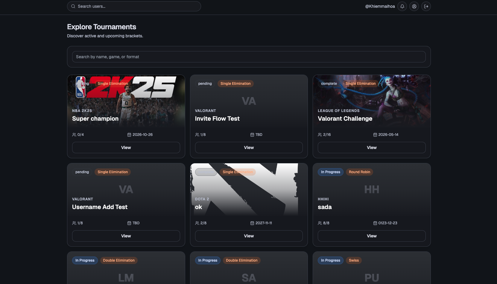
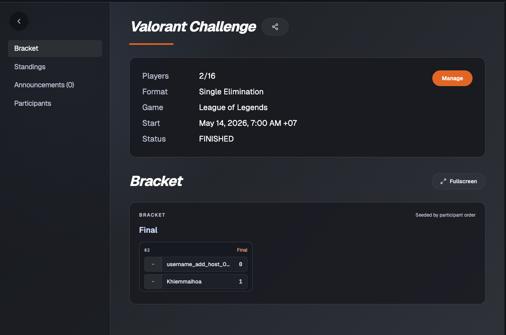
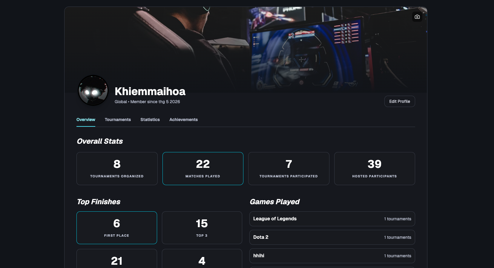

# Tournament Bracket Generator

Ứng dụng web quản lý giải đấu eSports theo thời gian thực, hỗ trợ tạo tournament, quản lý người chơi, sinh bracket, cập nhật kết quả trận đấu, bảng xếp hạng, thông báo và hồ sơ thành tích công khai của người dùng.

## Tổng Quan

Tournament Bracket Generator được xây dựng cho các host/community muốn tổ chức giải đấu nhanh, có giao diện quản trị trực quan và dữ liệu realtime. Người dùng có thể khám phá các giải đang mở, xem chi tiết bracket, theo dõi standings, nhận thông báo khi được mời tham gia và xem hồ sơ thành tích của người chơi khác.

## Tính Năng Chính

- Xác thực người dùng bằng JWT access token và refresh token.
- Tạo và quản lý tournament với nhiều thể thức: Single Elimination, Double Elimination, Round Robin, Swiss.
- Explore page có danh sách tournament kèm thumbnail game, trạng thái, format và số lượng participant.
- Tournament detail hiển thị bracket, standings, announcements và participants.
- Manage tournament cho host: thêm participant, invite user, generate bracket, report score, cập nhật Win/Lose.
- Notification flow khi host invite người chơi vào tournament.
- Public profile page với thống kê tournament, match, game đã chơi, top finishes và achievements.
- Header search user: tìm username và click để mở public profile.
- Backend realtime qua WebSocket + Redis Pub/Sub.
- Database migration tự chạy khi dùng Docker Compose.

## Screenshots

### 1. Landing Page

Trang giới thiệu sản phẩm với CTA tạo giải đấu và khám phá tournament.



### 2. Explore Page

Danh sách tournament public/upcoming, hỗ trợ search theo tên, game hoặc format. Mỗi card hiển thị thumbnail game và chỉ cho phép `View`.



### 3. Tournament Detail

Trang chi tiết tournament với sidebar điều hướng, thông tin giải đấu, bracket, standings, announcements và participants.



### 4. Profile Page

Public profile hiển thị avatar/cover, thống kê giải đấu, số trận đã chơi, thành tích, game đã tham gia và danh sách hosted tournaments.



> Lưu ý: đặt 4 ảnh minh họa vào thư mục `docs/screenshots/` với đúng tên file ở trên để README render hình ảnh đầy đủ.

## Tech Stack

| Layer            | Công nghệ                                                    |
| ---------------- | ------------------------------------------------------------ |
| Frontend         | React, Vite, Tailwind CSS, React Router, Axios, lucide-react |
| Backend          | FastAPI, SQLAlchemy Async, Pydantic, Uvicorn                 |
| Database         | PostgreSQL                                                   |
| Realtime / Cache | Redis, WebSocket, Celery                                     |
| DevOps           | Docker Compose, migration SQL idempotent                     |

## Cấu Trúc Dự Án

```text
.
├── backend/
│   ├── app/
│   │   ├── models/
│   │   ├── routers/
│   │   ├── schemas/
│   │   ├── services/
│   │   └── main.py
│   ├── docker-compose.yml
│   ├── init-db.sql
│   ├── repair_schema_refactor.sql
│   └── requirements.txt
├── frontend/
│   ├── src/
│   │   ├── api/
│   │   ├── components/
│   │   ├── pages/
│   │   └── App.jsx
│   └── package.json
└── docs/
    └── screenshots/
```

## Chạy Dự Án Local

### Yêu Cầu

- Docker và Docker Compose
- Node.js 18+
- Python 3.11+ nếu chạy backend ngoài container

### 1. Chạy Backend Bằng Docker Compose

```bash
cd backend
docker compose up --build
```

Docker Compose sẽ chạy:

- PostgreSQL tại `localhost:5432`
- Redis tại `localhost:6380`
- API tại `http://localhost:8000`
- Celery worker
- Migration service tự apply schema/seed data trước khi API start

API docs:

```text
http://localhost:8000/docs
```

Health check:

```text
http://localhost:8000/health
```

### 2. Chạy Frontend

```bash
cd frontend
npm install
npm run dev
```

Frontend chạy tại:

```text
http://localhost:5173
```

File cấu hình frontend:

```bash
cp frontend/.env.example frontend/.env
```

Giá trị mặc định:

```env
VITE_API_BASE_URL=http://localhost:8000
```

### 3. Chạy Backend Không Dùng API Container

Nếu muốn chạy Uvicorn trực tiếp trên máy local, chỉ bật Postgres/Redis bằng Docker:

```bash
cd backend
docker compose up -d postgres redis migrate
python -m venv venv
source venv/bin/activate
pip install -r requirements.txt
cp .env.example .env
```

Nếu Redis chạy từ Docker Compose, chỉnh `.env`:

```env
REDIS_URL=redis://localhost:6380/0
```

Sau đó chạy API:

```bash
uvicorn app.main:app --reload
```

Không dùng lệnh mẫu `uvicorn ten_file:ten_app --reload`; ASGI app đúng của dự án là `app.main:app`.

## Luồng Sử Dụng Nhanh

1. Mở `http://localhost:5173`.
2. Register hoặc Login.
3. Tạo tournament mới ở `Create Tournament`.
4. Thêm participant hoặc invite user theo username.
5. Generate bracket trong trang manage.
6. Report score cho từng match để cập nhật Win/Lose và standings.
7. Vào Explore để xem tournament public.
8. Search user ở header để xem public profile và achievements.

## Một Số Endpoint Quan Trọng

| Method | Endpoint                             | Mô tả                       |
| ------ | ------------------------------------ | --------------------------- |
| `POST` | `/auth/register`                     | Đăng ký tài khoản           |
| `POST` | `/auth/login`                        | Đăng nhập                   |
| `GET`  | `/search/tournaments`                | Explore/search tournaments  |
| `POST` | `/tournaments`                       | Tạo tournament              |
| `POST` | `/tournaments/{id}/generate-bracket` | Sinh bracket                |
| `POST` | `/matches/{id}/report`               | Báo cáo kết quả trận        |
| `GET`  | `/users/search`                      | Search user theo username   |
| `GET`  | `/users/{user_id}/profile`           | Xem public profile          |
| `POST` | `/users/me/media`                    | Upload avatar/cover profile |

## Kiểm Tra Build

Backend:

```bash
cd backend
venv/bin/python -m compileall app
```

Frontend:

```bash
cd frontend
npm run build
```

## Ghi Chú Migration

`backend/docker-compose.yml` có service `migrate`, tự chạy các file SQL idempotent khi `docker compose up`. Nhờ vậy dev khác chỉ cần pull code và chạy Docker Compose để cập nhật schema/database seed.
